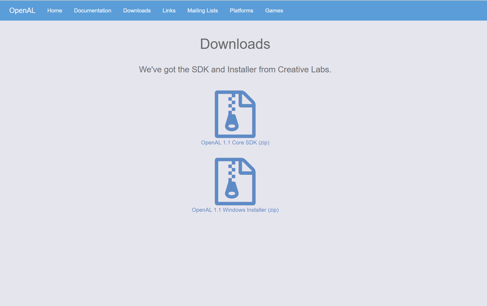
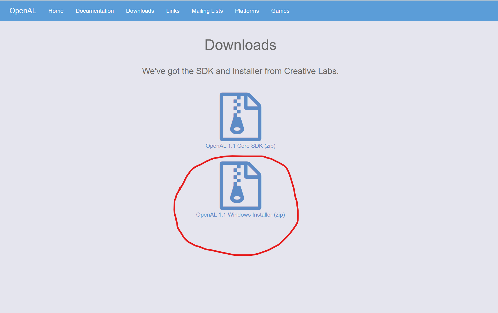
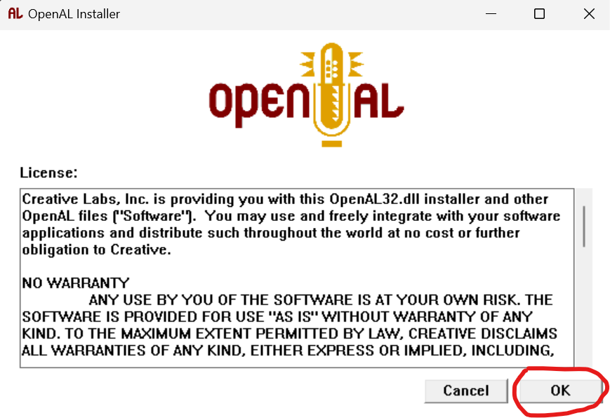
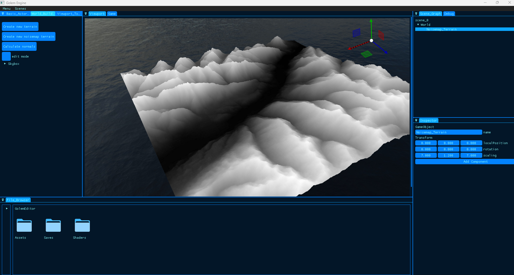
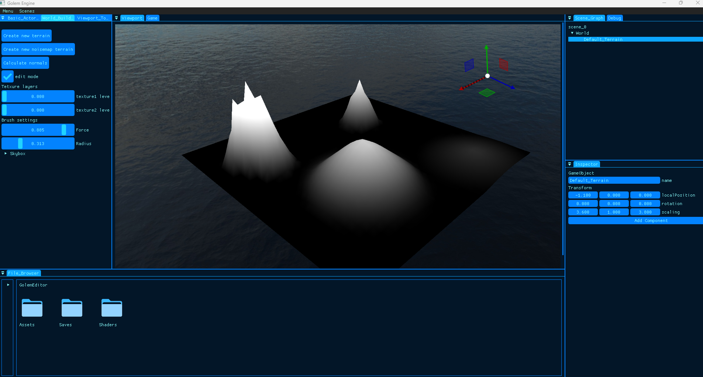
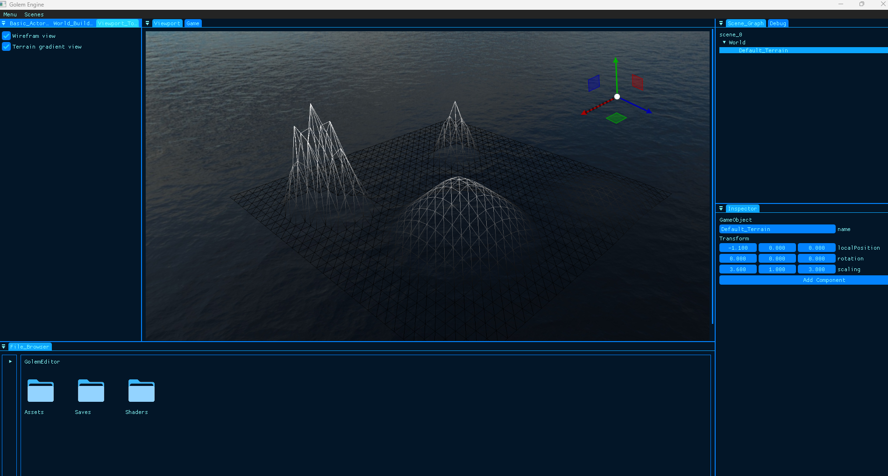
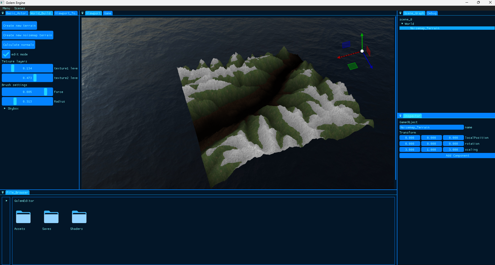

# Golem Engine

This is our game engine. It was made in 4 months by 4 people. The goal of this engine is firstly to learn more about the development of a game engine, but also to add our special touches to it and create custom features we enjoy using and creating. Special thanks to **Ziyi Wang** for creating the wonderful logo you can see right above. 

**Current version : *BETA***

## Useful links

TDD : https://docs.google.com/document/d/1Jtf2k2K6IGrmmmKho3yW_sFI192x4ObjKjQ_ZNkWz0c/edit?usp=drive_link

Backlogs : https://docs.google.com/spreadsheets/u/0/d/13i5iRtw7TFWCFSN_rtzIWthV1jdXRb6yfZKntQG_MpQ/edit

Trello : https://trello.com/w/golem_engine

Engine UML : https://app.diagrams.net/#G1YYfYapjmPG-OQKQSFgRh9GnygVCJJSjI

Interaction Diagram : https://app.diagrams.net/#G1OdVxF9WFAIje_cibcuFsyLmjxvCg91QG

## Setup

- **Download OpenAL**  
GolemEngine uses OpenAL library so it is necessary to download it on your device. GolemEngine already has OpenAL setup inside it but won't detect it if it isn't installed on your device.  
To Download it, go to https://www.openal.org/downloads/  
  
Download the Windows Installer (zip) :  
  
Open the .zip file and run the oalinst.exe file.  
Accept everything.  
  
OpenAL should be correctly installed now.

- **Download the engine**  
Clone the project.  
Open GolemEngine.sln in visual studio 2019.  
Make sure that the project settings C++ norm is 20.  
Set GolemEditor project as start up project.  
Run.  

## Functionalities

Golem Engine includes classical game engine features such as :
- Docked UI layout
- Windows :
    - Basic actors window 
    - Viewport
    - Viewport tools window
    - Scene graph
    - Debug
    - Inspector
    - File browser
- Scene management (load, create, save)
- Audio
- Physics  
  
You can navigate in the viewport using by using WASD and holding down right click.  
  
All functionalities are not listed in the README so feel free to discover them yourself.  
  
## Special Features  
  
### World Builder  
  
- ***Terrain Builder :***  
You can build a terrain in two different ways. The first method is to create a default flat terrain and set its vertices definition. The second method is to load the terrain from a heightmap.

- ***Vertex brush :***  
To edit the terrain vertices allowing to create mountains and valleys. Modify the radius and force to affect the vertices.~~~~

- ***Terrain Texture Layers :***  
To apply textures on the terrain.

